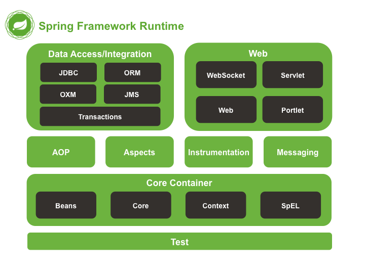

## Infrastructure

  
* **AOP (Aspect Oriented Programming):** Adds functionality to the objects declarativly such as Logging, security transactions etc. 

* **Instrumentations:** Makes use of class loader implementations to make use of different app services.

## Install Tomcat for mac os mojave
* **STEP 1:** Download Tomcat tar.gz 
* **STEP 2:** Untar the tar file. 
* **STEP 3:** Move the folder to /usr/local/ directory 
### `sudo mv apache-tomcat-9.0.21 /usr/local/`
* **STEP 4:** Create a soft link to make the installed version of tomcat easy to update, we create a Tomcat folder in Library directory by following command. 
### `sudo mkdir /Library/Tomcat/`
And then we create a soft link from /usr/local/apache-tomcat-9.0.21 to /Library/Tomcat/ directory by following command. 
### `sudo ls -s /usr/local/apache-tomcat-9.0.21 /Library/Tomcat`
* **STEP 5:** Add execute permission to the .sh file present inside the bin derectory of the apache-tomcat-x.x.xx package
### `sudo chmod +x /Library/Tomcat/apache-tomcat-9.0.21/bin/*.sh`
